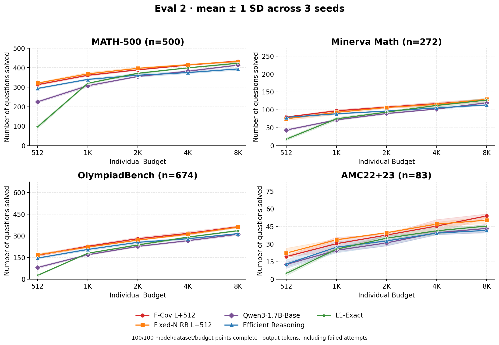
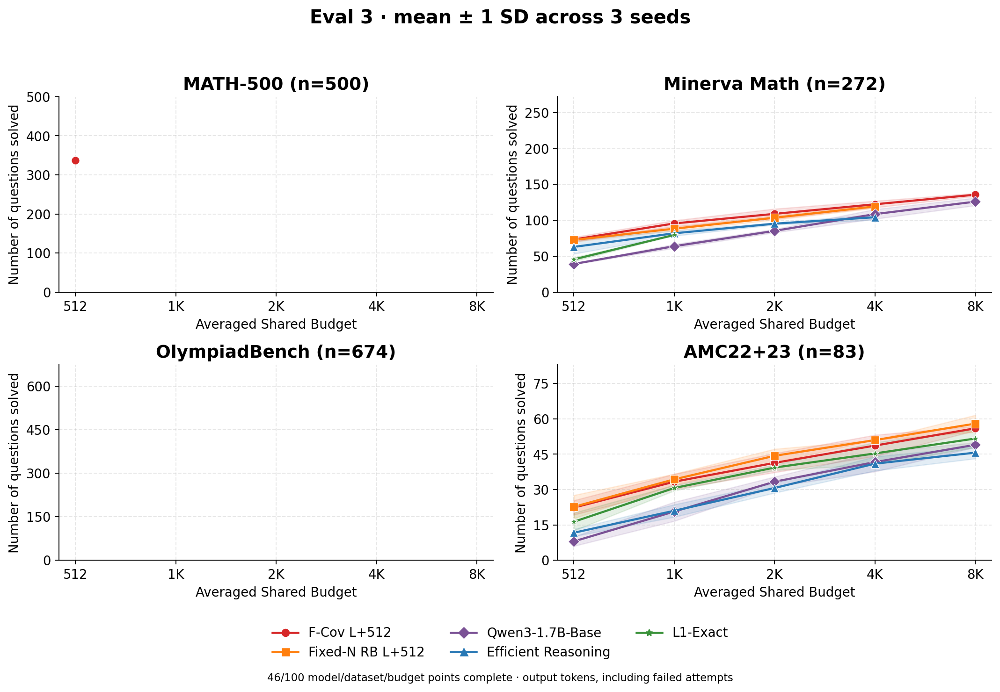

# Math evaluation matrix

Completed budget/seed points: 541/700.

All models use the same ordinary math prompt; L1 has no length instruction. Costs count generated output tokens, including failed attempts and EOS, not prompt tokens.

## Eval 1: mean@4 accuracy

The table is mean correctness over four independent responses per question, not pass@4.

### MATH-500 (500 questions)

| Model | 256 | 512 | 1024 | 2048 | 4096 |
|---|---:|---:|---:|---:|---:|
| F-Cov L+512 | 43.35% | 58.15% | 62.00% | 62.25% | 62.45% |
| Fixed-N RB L+512 | 45.65% | 60.35% | 63.40% | 63.60% | 63.65% |
| Qwen3-1.7B-Base | 18.25% | 44.40% | 55.70% | 57.65% | 57.55% |
| Efficient Reasoning | 43.70% | 57.50% | 63.45% | 64.80% | 65.05% |
| L1-Exact | 2.90% | 19.65% | 64.20% | 67.10% | 66.95% |

### Minerva Math (272 questions)

| Model | 256 | 512 | 1024 | 2048 | 4096 |
|---|---:|---:|---:|---:|---:|
| F-Cov L+512 | 16.73% | 24.72% | 25.92% | 26.01% | 25.74% |
| Fixed-N RB L+512 | 18.01% | 25.09% | 25.64% | 25.83% | 25.83% |
| Qwen3-1.7B-Base | 5.70% | 14.80% | 20.77% | 20.68% | 20.96% |
| Efficient Reasoning | 17.65% | 24.82% | 26.01% | 26.10% | 26.29% |
| L1-Exact | 2.11% | 5.97% | 26.29% | 27.85% | 29.14% |

### OlympiadBench (674 questions)

| Model | 256 | 512 | 1024 | 2048 | 4096 |
|---|---:|---:|---:|---:|---:|
| F-Cov L+512 | 9.46% | 22.89% | 27.34% | 28.08% | 28.04% |
| Fixed-N RB L+512 | 10.35% | 22.48% | 25.78% | 26.52% | 26.56% |
| Qwen3-1.7B-Base | 2.52% | 10.83% | 21.44% | 23.07% | 23.44% |
| Efficient Reasoning | 8.68% | 21.03% | 28.30% | 30.30% | 30.64% |
| L1-Exact | 1.52% | 4.82% | 27.04% | 29.75% | 29.93% |

### AMC22+23 (83 questions)

| Model | 256 | 512 | 1024 | 2048 | 4096 |
|---|---:|---:|---:|---:|---:|
| F-Cov L+512 | 10.84% | 26.51% | 31.93% | 30.42% | 31.93% |
| Fixed-N RB L+512 | 13.55% | 24.70% | 32.23% | 31.63% | 32.23% |
| Qwen3-1.7B-Base | 3.92% | 12.05% | 22.89% | 25.90% | 25.60% |
| Efficient Reasoning | 6.93% | 12.05% | 26.20% | 28.31% | 29.22% |
| L1-Exact | 1.20% | 6.33% | 31.93% | 34.04% | 34.04% |

## Eval 2

Only points with every requested seed complete are plotted; bands show sample standard deviation, not confidence intervals.

Each question stops at its first correct response or budget exhaustion. Unused tokens are not transferred; x is the allocated individual budget, not actual consumption.

## Eval 3

Only points with every requested seed complete are plotted; bands show sample standard deviation, not confidence intervals.

